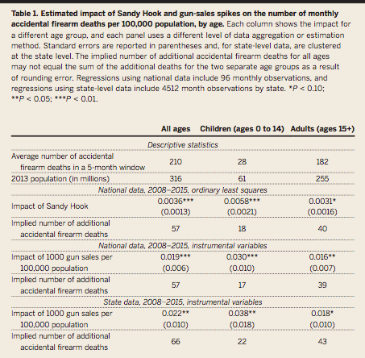

```{r setup, include=FALSE}
knitr::opts_chunk$set(echo = FALSE, warning = FALSE, message = FALSE)

# Importing all necessary libraries.
# Setting echo to false so that the chunk code is not produced in the output document. 

library(haven)
library(ggplot2)
library(dplyr)
library(gt)
library(usmap)
library(patchwork)
library(zoo)
library(readxl)
library(tidyverse)
```

### Abstract
Levine and McKnight (2017) show that in the 5-month period following the Sandy Hook school shooting in December 2012, a large spike in gun sales contributed to an increase in accidental firearm deaths. Their findings conclude that there was a spike in accidental firearm deaths resulting from the increase in exposure, which is confirmed in this replication. As an extension to this paper, the original linear regression used to determine the increase in firearm sales per 100,000 popoulation in the post-Sandy Hook period was changed to a Bayesian generalized linear model. Even after this change, the resuts showing increases in certain states hold, backing the authors' claims.  Even though the Sandy Hook shooting showed the need for stricter gun laws, the immediate aftermath of this realization led to the opposite effect as desired: more accidental firearm deaths.

### Introduction
This replication paper takes a look at gun sales, background checks, and google search data in the aftermath of the Sandy Hook school shooting that took place on December 14th, 2012. It is hard for one to not know about the atrocities that took place in Newtown, Connecticut that day, as innocent school children and their teachers were murdered at school. Since then, many reforms have been put in place for gun control and school safety alike. In the immediate aftermath, however, gun sales spiked and google searches about buying and cleaning guns soared. People knew that the number of background checks were going to increase to prevent further events like this from happening. This paper analyzes, specifically, whether there was an increase in the number of accidental gun deaths in the five-month period following this event, which could then be attributed to the increase in gun sales. The authors also took a look at accidental firearm deaths by state, so that they could see whether states with a larger increase in firearm sales also had an increase in the accidental deaths. To run this analysis, they calculated death rates among children and among adults and ran regressions, controlling for trends and seasonal patterns. In the end, the authors concluded that "an additional 60 deaths overall, including 20 children,
resulted from unintentional shootings in the immediate aftermath of Sandy Hook" (Levine et al. 1).

Within this replication, I have made three graphs and a table. The first graph details the change in Google searches about cleaning and buying goods in the years leading up to and following Sandy Hook. There is an obvious spike in the data in the post-Sandy Hook window. The second graph looks at "seasonally adjusted, detrended monthly firearm sales and accidental firearm death rates" among children under the age of 15. And finally the third graph shows a map of the US, with each state colored by the amount increase in firearm sales per 100,000 population in the post-Sandy Hook period (December 2012 - April 2013). To create these graphics, I used datasets that were built using R, CDC NCHS data, Stata, and data obtained through Harvard's Dataverse. All the data used to produce this replication can be found on my GitHub repository. ^[My GitHub repo can be found following this url: https://github.com/h-valencia/1006-milestone-4]

### Literature Review
In the aftermath of the Sandy Hook Elementary School shooting, President Barack Obama took a stance against guns, calling for stricter gun control legislation. After announcing this, Americans became more interested in owning guns, and Levine and McKnight have estimated an additional 3 million guns were sold in the 5-month period following the shooting. Whether people be buying new guns, or revisiting and cleaning ones that have owned for years, the greater exposure to guns following the shooting may have likely driven an increase in the number of accidental deaths caused by firearms, especially amongst children. When former President Obama spoke about the new gun control legislation in mid-January and mid-February of 2013, search activity about guns spiked immediately. In specific states and areas where gun sales spiked, it was found that the number of accidental deaths also spiked. Although this correlation does not a cause and effect relationship, it should be noted.

Within the models created, there are multiple caveats to consider. Many of the models were created using the CDC National Center for Health Statistics's Vital Statistics mortality data, which are known to underestimate accidental firearm deaths. Another consideration that should be made is that this data only accounts for accidental firearm discharges that resulted in death, it does not include any cases where victims survived, therefore providing a lower bound on the issue at hand. The restrictions imposed on the cause of death we are interested in also limits the data to omit any suicides or homicides due to firearm exposure during this time period. The paper in consideration also only displays short-term implications of increased gun exposure, not long term effects.

In an effort to mitigate the likelihood of school shootings, one proposal has been to arm teachers with guns, giving them a way to protect themselves and their students. There have been, however, instances where teachers then use these weapons against themselves or their students, albeit this does not occur frequently (Buck et al.).


```{r ImportExcel, message = FALSE, warning = FALSE}

# Setting message = FALSE because it is telling us about renaming the columns when we first load in the data, but we are going to be changing these names anyways.
# Setting warning = FALSE because a warning appears about the date format.
# Reading in the excel sheet.

google <- read_xlsx("raw-data/dataverse_files/Google Trends data for Figure 1.xlsx", 
    col_types = c("date", "numeric", "numeric"))

# Removing two rows that are either empty or are just describing the data set.

google <- google[-c(1, 2),]

# Chnaging the column titles to the first row's information.

colnames(google) = google[1, ]
google = google[-1, ]

colnames(google)[1:3] <- c("week", "clean_gun", "buy_gun")

google$week <- as.Date(google$week , format = "%Y-%m-%d")
```

```{r ShiftAxis}

# Creating a function for shifting the axis labels to the line y=0 instead of having it hover slightly below. 
# For aesthetic purposes.
# Function obtained from https://stackoverflow.com/questions/39071002/moving-x-or-y-axis-together-with-tick-labels-to-the-middle-of-a-single-ggplot-n, user baptiste.

shift_axis <- function(p, y=0){
  g <- ggplotGrob(p)
  dummy <- data.frame(y=y)
  ax <- g[["grobs"]][g$layout$name == "axis-b"][[1]]
  p + annotation_custom(grid::grobTree(ax, vp = grid::viewport(y=1, height=sum(ax$height))), 
                        ymax=y, ymin=y) +
    geom_hline(aes(yintercept=y), data = dummy) +
    theme(axis.text.x = element_blank(), 
          axis.ticks.x=element_blank())

}
```

### Tables and Figures
#### Figure 1
```{r CreateGraphic}

# Using ggplot with geom_line to reproduce Fig. 1 from my paper.
# Creating two lines on the same graph, for google searches of "clean gun" and of "buy gun", each with a different color.
# Using annotate to create a shaded rectangle in the "Post-Sandy Hook Window" which is the 4 months following the shooting. Set alpha to 0.2 to make it see through.
# Set the x scale to have breaks every year.
# Set the y scale to have breaks every 20 from 1 to 120.
# Added labels to the axes and a caption.
# Changed the graph theme to look more like the one in the paper being reproduced.
# Removed the vertical lines and changed the horizontal line darkness and where they are located.
# Changed the location and size of the caption.
# Added text onto the graph.
# Used the shift_axis function to move the labels up to the y=0 line and remove the weird space.

plot <- google %>%
  ggplot(aes(x = week)) +
  geom_line(aes(y = clean_gun), color = "black") +
  geom_line(aes(y = buy_gun), color = "red") +
  annotate("rect", xmin = as.Date('2012-12-14'), xmax = as.Date('2013-04-14'), ymin = 0, ymax = Inf, alpha = 0.2) +
  scale_x_date(date_breaks = "1 year", date_minor_breaks = "1 month", date_labels = "%Y") +
  scale_y_continuous(breaks = c(0, 20, 40, 60, 80, 100, 120), limits = c(0, 120)) +
  labs(x = "", 
       y = "Index Value (100 = maximum)", 
       caption = " Fig. 1. Relative frequency of weekly Google searches that included the terms “clean gun” and \n “buy gun” between 2010 and 2014. This graph uses data from Google Trends (http://trends. \ngoogle.com/) to track weekly patterns in search activity that included each set of words. The week \nwith maximum search volume is indexed to equal 100 and values below 100 reflect relative search \n      activity in proportion to the week with the maximum value.") +
  theme(panel.grid.major.x = element_blank(),
        panel.grid.major.y = element_line( size=0.3, color = "darkgray"),
        panel.background = element_rect(fill= "white"),
        plot.caption = element_text(hjust = -0.1, size = 10)) +
  annotate(geom = "text", x = as.Date('2013-11-15'), y = 96, label = "Post-Sandy Hook Window", size = 3) +
  annotate(geom = "text", x = as.Date('2010-06-15'), y = 56, label = "'Clean Gun' (black line)", size = 3) +
  annotate(geom = "text", x = as.Date('2010-05-15'), y = 11.5, label = "'Buy Gun' (red line)", size = 3)

shift_axis(plot, 0)
```


#### Figure 2
```{r ReadFiles}

# Reading in files from the dataverse to make manipulation easier later on.
 
bsp <- read_dta("raw-data/dataverse_files/bckcheck-state-public.dta")
psp <- read_dta("raw-data/dataverse_files/population-state-public.dta")
```

```{r ReadingStataFig2}

# Reading in data that was created using the Stata replication code provided by the author.

dap <- read_dta("raw-data/deaths-age-public.dta")
fig2sales <- read_xlsx("raw-data/fig2salesdata.xlsx")
fig2deaths <- read_xlsx("raw-data/fig2deathsdata.xlsx")
```

```{r CreateDate}

# Creating a date column for each dataset to give them a common column.
# Formatting the date column from already existing year and/or month columns.

fig2sales$Date <- as.yearmon(paste(fig2sales$year, fig2sales$month), "%Y %m")
fig2deaths$Date <- as.yearmon(paste(fig2deaths$year), "%Y")

# Joining the two dataframes together by the data column.
# Filtering the year column for earlier than 2016 since this is all that the figure examines.

fig2full <- full_join(fig2sales, fig2deaths, by = "Date") %>%
  filter(year.x < 2016)

# Replacing NAs with 0.

fig2full[is.na(fig2full)] <- 0
```


```{r CreateFig2, warning = FALSE}

# Set warning = FALSE because different x axes result in a warning but do not cause issues within the graph.
# Using options to make the axes intervals not change to scientific notation.

options(scipen=999)

# Rough plots used as reference.

fig2.1 <- ggplot(data = fig2sales, aes(x = Date)) +
  geom_line(aes(y = resid))

fig2.2 <- ggplot(data = fig2deaths, aes(x = Date)) +
  geom_col(aes(y = resid), fill = "skyblue3", width = 0.4)

# Using ggplot with the combined data set.
# Adding a geom_col layer for the residual values of the death data multiplied by 50,000,000 to line the axis scale up with the other.
# Changing the color and width of the bars.
# Adding a geom_line layer to plot the residual values for the sales data.
# Added a second axis in the scale_y_continuous to get different scales on each side of the graph.

ggplot(fig2full, aes(x = Date)) +
  geom_col(aes(y = resid.y*50000000), fill = "skyblue3", width = 0.4) +
  geom_line(aes(y = resid.x)) +
  labs(x = "",
       caption = "Fig. 2. Seasonally adjusted, detrended monthly firearm sales and accidental firearm death 
       rates per 100,000 children (ages 0 to 14) between December and April. Firearm sales data 
       are proxied by NICS data on background checks conducted when a firearm is purchased from 
       a registered dealer. The accidental firearm death rate is calculated from Vital Statistics 
       mortality data and SEER population data. The post–Sandy Hook window is defined to be 
       December 2012 through April 2013") +
  scale_y_continuous(limits = c(-1200000, 1200000), 
                     breaks = c(-1200000, -800000, -400000, 0, 400000, 800000, 1200000),
    name = "Deviations from Expected Monthly Firearm Sales",
    sec.axis = sec_axis(~./50000000, name="Deviations from Expected Accidental Firearm Death Rates for Children"))

  #theme(panel.grid.major.x = element_blank(),
        #panel.grid.major.y = element_line( size=0.3, color = "darkgray"),
        #panel.background = element_rect(fill= "white"),
        #plot.caption = element_text(hjust = 0, size = 10))
```


#### Figure 3

```{r ReadStataOutput}

# Replicated regression tables in Stata using the replication .do file provided by the author.
# Author indicated that information relevant to creating the figure was the first coefficient in each state's regression.
# I manually took these coefficients and the state codes and created a excel file with these two variables.
# Reading in the excel file.

fig3 <- read_xlsx("raw-data/Fig3Coeffs.xlsx")
```

```{r JoiningData, warning = FALSE}

# Multiplying the regression coefficient from the excel file by 5, indicating the five month window that the author has defined as the "post-Sandy Hook" window.
# Renaming the state column to stname to match the column in the other datasets.

fig3 <- fig3 %>%
  mutate(shcoef = RegCoeff*5) %>%
  mutate(stname = State) 

# Changing the other dataset from the dataverse so that there is only one row per state.
# Selecting the state name column and the column with the state FIPS codes.
# Needed a dataset with the FIPS codes so that I could create the map later on.

fig3a <- bsp %>%
  distinct(stfips, .keep_all = TRUE) %>%
  select(stfips, stname)

# Using left join to add the state FIPS codes to the excel dataframe.
# Renaming the stfips column to fips so that it can be processed by the US map plot.

fig3b <- left_join(fig3, fig3a, by = "stname") %>%
  mutate(fips = stfips)

# Creating a color column that groups the states into the four categories of gun sales.
# Have not yet been able to figure out how to break apart the scale into 4 distinct categories, but this seems like it would be a helpful step.

fig3b$color[fig3b$shcoef < 750] = "cream"
fig3b$color[fig3b$shcoef >= 750 & fig3b$shcoef < 1000] = "yellow"
fig3b$color[fig3b$shcoef >= 1000 & fig3b$shcoef < 1500] = "orange"
fig3b$color[fig3b$shcoef >= 1500] = "red"
fig3b$color[is.na(fig3b$shcoef)] <- "No data"
```

```{r PlotMap}

# Creating a map of the US with the sandy hook window coefficients for each state.
# Changed the color of the map to match that of the original. 
# Changed the direction of the fill so the light colors are the lower numbers and the darker colors are the higher numbers.
# Used theme to adjust the caption size and the legend position.
# Added a caption.

plot_usmap(data = fig3b, values = "shcoef") +
  scale_fill_distiller(palette = "YlOrRd", direction = 1) +
  theme(legend.position = "right",
        plot.caption = element_text(hjust = 0, size = 10)) +
  labs(caption = "       Fig. 3. Variation across states in the increase in firearm sales per 100,000 
      population in the post–Sandy Hook period. The spike in sales in each state is
       estimated as the seasonally adjusted and detrended increase in background 
       checks in the months within the Sandy Hook window. The legend numbers 
       represent the increase in firearm sales per 100,000 population.")
```

#### Table 1


### Extension
```{r ExtBox}
ggplot(fig3, aes(x = State, y = glmCoeff)) +
  geom_point(size = 2, color = "orange") +
  geom_point(aes(y = RegCoeff), alpha = 0.3) +
  geom_errorbar(aes(ymax = highCI, ymin = lowCI),color = "orange") +
  theme(axis.text.x = element_text(face = "bold", color = "red", angle=90),
        axis.title.y = element_text(size = 9),
        panel.grid.major.x = element_blank(),
        panel.grid.major.y = element_line( size=0.3, color = "darkgray"),
        panel.background = element_rect(fill= "white")) +
  labs(x = "State",
       y = "Bayesian GLM Coefficient",
       title = "Increase in Firearm Sales per 100,000 per month in the post-Sandy Hook Period",
       subtitle = "Box plots of Bayesian glm coefficient",
       caption = "The orange error bars show the glm coefficient estimations, while the grey point shows the linear model coefficient.")
```

```{r ExtTable}
fig3 %>%
  select(State, glmCoeff, stdev, mcse, lowCI, highCI) %>%
  gt() %>%
  fmt_number(columns = 2:6, decimals = 2) %>%
  cols_label(glmCoeff = "mean (bayes glm)",
             stdev = "Std. Dev.",
             mcse = "MCSE",
             lowCI = "lower CI",
             highCI = "upper CI") %>%
  tab_spanner(label = "95% Confidence Interval",
              columns = 5:6) %>%
  tab_header(title = "Firearm Sales per 100,000 population per month in the post-Sandy Hook period")
```


As an extension to this paper, the original linear regression used to determine the increase in firearm sales per 100,000 popoulation in the post-Sandy Hook period was changed to a Bayesian generalized linear model. The simulation was run through Stata for each state, giving an estimated mean coefficient, standard deviation, MCSE, and 95% CI. The graph of box plots shows the mean estimate of the coefficient and the bounds of the 95% CI for this coefficient. Even after the change in regression type, the resuts showing increases in certain states hold and the linear model coefficient falls within the CI, backing the authors' claims. The tables sums up the mean estimate for the Bayesian glm models, along with the standard deviation, MCSE, and 95% confidence interval produced from running the Bayesian simulation.


### Appendix
#### Figure 1
```{r Fig1Code, echo = TRUE}

# Using ggplot with geom_line to reproduce Fig. 1 from my paper.
# Creating two lines on the same graph, for google searches of "clean gun" and of "buy gun", each with a different color.
# Using annotate to create a shaded rectangle in the "Post-Sandy Hook Window" which is the 4 months following the shooting. Set alpha to 0.2 to make it see through.
# Set the x scale to have breaks every year.
# Set the y scale to have breaks every 20 from 1 to 120.
# Added labels to the axes and a caption.
# Changed the graph theme to look more like the one in the paper being reproduced.
# Removed the vertical lines and changed the horizontal line darkness and where they are located.
# Changed the location and size of the caption.
# Added text onto the graph.
# Used the shift_axis function to move the labels up to the y=0 line and remove the weird space.

plot <- google %>%
  ggplot(aes(x = week)) +
  geom_line(aes(y = clean_gun), color = "black") +
  geom_line(aes(y = buy_gun), color = "red") +
  annotate("rect", xmin = as.Date('2012-12-14'), xmax = as.Date('2013-04-14'), ymin = 0, ymax = Inf, alpha = 0.2) +
  scale_x_date(date_breaks = "1 year", date_minor_breaks = "1 month", date_labels = "%Y") +
  scale_y_continuous(breaks = c(0, 20, 40, 60, 80, 100, 120), limits = c(0, 120)) +
  labs(x = "", 
       y = "Index Value (100 = maximum)", 
       caption = " Fig. 1. Relative frequency of weekly Google searches that included the terms “clean gun” and \n “buy gun” between 2010 and 2014. This graph uses data from Google Trends (http://trends. \ngoogle.com/) to track weekly patterns in search activity that included each set of words. The week \nwith maximum search volume is indexed to equal 100 and values below 100 reflect relative search \n      activity in proportion to the week with the maximum value.") +
  theme(panel.grid.major.x = element_blank(),
        panel.grid.major.y = element_line( size=0.3, color = "darkgray"),
        panel.background = element_rect(fill= "white"),
        plot.caption = element_text(hjust = -0.1, size = 10)) +
  annotate(geom = "text", x = as.Date('2013-11-15'), y = 96, label = "Post-Sandy Hook Window", size = 3) +
  annotate(geom = "text", x = as.Date('2010-06-15'), y = 56, label = "'Clean Gun' (black line)", size = 3) +
  annotate(geom = "text", x = as.Date('2010-05-15'), y = 11.5, label = "'Buy Gun' (red line)", size = 3)

shift_axis(plot, 0)
```

#### Figure 3
```{r Fig3Code, warning = FALSE, echo = TRUE}

# Replicated regression tables in Stata using the replication .do file provided by the author.
# Author indicated that information relevant to creating the figure was the first coefficient in each state's regression.
# I manually took these coefficients and the state codes and created a excel file with these two variables.
# Reading in the excel file.

fig3 <- read_xlsx("raw-data/Fig3Coeffs.xlsx")

# Multiplying the regression coefficient from the excel file by 5, indicating the five month window that the author has defined as the "post-Sandy Hook" window.
# Renaming the state column to stname to match the column in the other datasets.

fig3 <- fig3 %>%
  mutate(shcoef = RegCoeff*5) %>%
  mutate(stname = State) 

# Changing the other dataset from the dataverse so that there is only one row per state.
# Selecting the state name column and the column with the state FIPS codes.
# Needed a dataset with the FIPS codes so that I could create the map later on.

fig3a <- bsp %>%
  distinct(stfips, .keep_all = TRUE) %>%
  select(stfips, stname)

# Using left join to add the state FIPS codes to the excel dataframe.
# Renaming the stfips column to fips so that it can be processed by the US map plot.

fig3b <- left_join(fig3, fig3a, by = "stname") %>%
  mutate(fips = stfips)

# Creating a color column that groups the states into the four categories of gun sales.
# Have not yet been able to figure out how to break apart the scale into 4 distinct categories, but this seems like it would be a helpful step.

fig3b$color[fig3b$shcoef < 750] = "cream"
fig3b$color[fig3b$shcoef >= 750 & fig3b$shcoef < 1000] = "yellow"
fig3b$color[fig3b$shcoef >= 1000 & fig3b$shcoef < 1500] = "orange"
fig3b$color[fig3b$shcoef >= 1500] = "red"
fig3b$color[is.na(fig3b$shcoef)] <- "No data"

# Creating a map of the US with the sandy hook window coefficients for each state.
# Changed the color of the map to match that of the original. 
# Changed the direction of the fill so the light colors are the lower numbers and the darker colors are the higher numbers.
# Used theme to adjust the caption size and the legend position.
# Added a caption.

plot_usmap(data = fig3b, values = "shcoef") +
  scale_fill_distiller(palette = "YlOrRd", direction = 1) +
  theme(legend.position = "right",
        plot.caption = element_text(hjust = 0, size = 10)) +
  labs(caption = "       Fig. 3. Variation across states in the increase in firearm sales per 100,000 
      population in the post–Sandy Hook period. The spike in sales in each state is
       estimated as the seasonally adjusted and detrended increase in background 
       checks in the months within the Sandy Hook window. The legend numbers 
       represent the increase in firearm sales per 100,000 population.")
```


### References

[@R-ggplot2]
[@R-knitr]
[@knitr2015]
[@knitr2014]
[@ggplot22]
[@R-haven]
[@levine2017firearms]
[@CDC]
