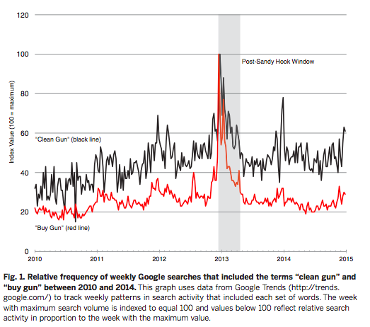
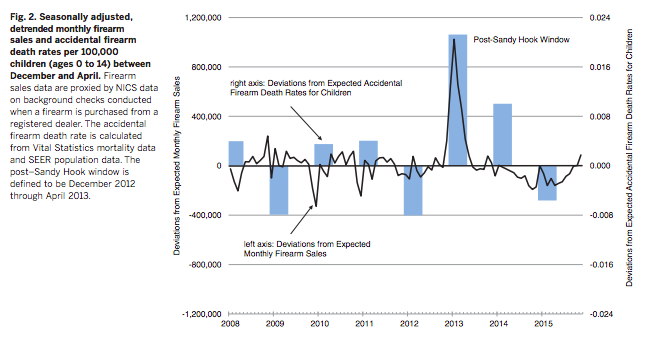
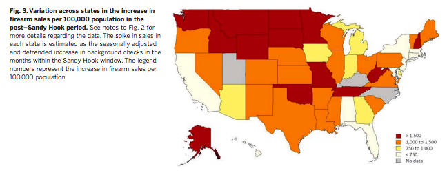
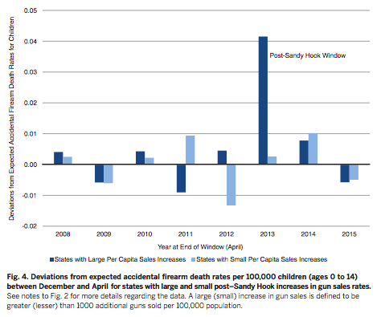
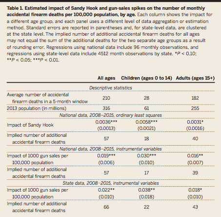

```{r setup, include=FALSE}
knitr::opts_chunk$set(echo = FALSE, warning = FALSE, message = FALSE)

# Importing all necessary libraries.
# Setting echo to false so that the chunk code is not produced in the output document. 

library(haven)
library(ggplot2)
library(dplyr)
library(gt)
library(usmap)
library(patchwork)
library(zoo)
library(readxl)
library(tidyverse)
```

### Abstract
Levine and McKnight (2017) show that in the 5-month period following the Sandy Hook school shooting in December 2012, a large spike in gun sales contributed to an increase in accidental firearm deaths. Their findings conclude that there was a spike in accidental firearm deaths resulting from the increase in exposure, which is confirmed in this replication. I was able to successfully replicate most of Levine and McKnight's results. As an extension to this paper, the original linear regression used to determine the increase in firearm sales per 100,000 popoulation in the post-Sandy Hook period was changed to a Bayesian generalized linear model. Even after this change, the results showing increases in certain states hold, backing the authors' claims.  Even though the Sandy Hook shooting showed the need for stricter gun laws, the immediate aftermath of this realization led to the opposite effect as desired: more accidental firearm deaths.

### Introduction
This replication paper takes a look at gun sales, background checks, and google search data in the aftermath of the Sandy Hook school shooting that took place on December 14th, 2012. It is hard for one to not know about the atrocities that took place in Newtown, Connecticut that day, as innocent school children and their teachers were murdered at school. Since then, many reforms have been put in place for gun control and school safety alike. In the immediate aftermath, however, gun sales spiked and google searches about buying and cleaning guns soared. People knew that the number of background checks were going to increase to prevent further events like this from happening. This paper analyzes, specifically, whether there was an increase in the number of accidental gun deaths in the five-month period following this event, which could then be attributed to the increase in gun sales. The authors also took a look at accidental firearm deaths by state, so that they could see whether states with a larger increase in firearm sales also had an increase in the accidental deaths. To run this analysis, they calculated death rates among children and among adults and ran regressions, controlling for trends and seasonal patterns. In the end, the authors concluded that "an additional 60 deaths overall, including 20 children,
resulted from unintentional shootings in the immediate aftermath of Sandy Hook" (Levine, McKnight 1).

Within this replication, I used both Stata and R (R Core Team, 2019) to replicate some of the figures in the original article. The data and replication code were obtained from the Harvard Dataverse ^[The replication data and programs for this paper can be found at https://dataverse.harvard.edu/dataset.xhtml?persistentId=doi:10.7910/DVN/EVLKBN] and through the CDC NCHS ^[In replicating the author's code, I was instructed to compile mortality statistics from https://www.cdc.gov/nchs/data_access/vitalstatsonline.htm]. The first graph details the change in Google searches about cleaning and buying goods in the years leading up to and following Sandy Hook. There is an obvious spike in the data in the post-Sandy Hook window. The second graph looks at "seasonally adjusted, detrended monthly firearm sales and accidental firearm death rates" among children under the age of 15. And finally the third graph shows a map of the US, with each state colored by the amount increase in firearm sales per 100,000 population in the post-Sandy Hook period (December 2012 - April 2013). All the data used to produce this replication can be found on my GitHub repository. ^[My GitHub repo can be found following this url: https://github.com/h-valencia/1006-milestone-4]

Through my replication of the authors' code, I found many of the same results. I was able to successfully replicate Levine and McKnight's results, with the exception of deviations from expected accidental firearm death rate, as it required using private mortality data. I ran much of the replication using their original Stata code provided by the authors, then transfered the results to R in order to more acurately replicate the figures. The private morality data prevented me from replicating the fourth figure and the table. Through my replication of figure 1, I confirmed the author's findings that there was a very large spike in Google searches of buying and cleaning guns in the aftermath of Sandy Hook. Through my replication of figure 3, I also found that gun sales increased after Sandy Hook in almost all states to varying degrees. Although I did not replicate the figure 2 graph, I did replicate the data tables that were used in making it. The results of these tables confirmed the authors' findings that there was a spike in firearm death rates for children after Sandy Hook and at the same time as an increase in monthly firearm sales.

In the original paper, the authors concluded that there was "an additional 60 deaths overall, including 20 children,
resulted from unintentional shootings in the immediate aftermath of Sandy Hook" (Levine, McKnight 1). Since these quantified increases were found using private mortality data from the NCHS, I was unable to replicate these findings and get an exact number of additional deaths. Figure 4 shows a generalized view of this increase by showing that states with large per capita sales increases had a spike in deviations from expected accidental firearm death rates in the post-Sandy Hook window. 


### Literature Review
In the aftermath of the Sandy Hook Elementary School shooting, President Barack Obama took a stance against guns, calling for stricter gun control legislation. After announcing this, Americans became more interested in owning guns, and Levine and McKnight have estimated an additional 3 million guns were sold in the 5-month period following the shooting. Whether people were buying new guns, or revisiting and cleaning ones that have owned for years, the greater exposure to guns following the shooting may have likely driven an increase in the number of accidental deaths caused by firearms, especially amongst children. When former President Obama spoke about the new gun control legislation in mid-January and mid-February of 2013, search activity about guns spiked immediately. In specific states and areas where gun sales spiked, it was found that the number of accidental deaths also spiked. Although this correlation is not a cause and effect relationship, it should be noted.

Within the models created, there are multiple caveats to consider. Many of the models were created using the CDC National Center for Health Statistics's Vital Statistics mortality data, which are known to underestimate accidental firearm deaths. Another consideration that should be made is that this data only accounts for accidental firearm discharges that resulted in death, it does not include any cases where victims survived, therefore providing a lower bound on the issue at hand. The restrictions imposed on the cause of death we are interested in also limits the data to omit any suicides or homicides due to firearm exposure during this time period. The paper also only displays short-term implications of increased gun exposure, not long term effects.

In an effort to mitigate the likelihood of school shootings, one proposal has been to arm teachers with guns, giving them a way to protect themselves and their students. There have been, however, instances where teachers then use these weapons against themselves or their students, albeit this does not occur frequently (Buck et al.).

Through other research papers, it has been reported that the sharp increase in gun sales following Sandy Hook and President Obama's dialog on gun control legislation also led to stock-out, rationing, and shortages of ammunition. Background checks conducted increased by 60% in the first 6 months of 2013, part of which can almost certainly be attributed to increased gun sales. The paradox of an increase in gun exposure while the government proposes legislation in restricting sales was an issue following the attack, and could arise again at further attempts by the government to limit firearm exposure (Jones, Stone 167).

"Background checks in 2013 represented an 8 percent increase over 2012, and almost doubled  the  number  conducted  in  2007. In  descending  order  the  three  highest  months  on  record  for  background checks were: December 2012, January 2013 and February 2013" (Jones, Stone 170). This increase in background checks is not identical to the number of firearm sales, as not every background results in the purchase of a gun. Private firearm sales also go unaccounted for, and since most US firearm manufacturers are privately owned, they are not required to report their sales. 

### Extension

As an extension to this paper, the original linear regression used to determine the increase in firearm sales per 100,000 popoulation in the post-Sandy Hook period was changed to a Bayesian generalized linear model. The simulation was run through Stata for each state, giving an estimated mean coefficient, standard deviation, MCSE, and 95% CI. The graph of box plots shows the mean estimate of the coefficient and the bounds of the 95% CI for this coefficient. Even after the change in regression type, the resuts showing increases in certain states hold and the linear model coefficient falls within the CI, backing the authors' claims.

### Figures and Tables
#### Plot of Extension
```{r ReadStataOutput, warning = FALSE}

# Replicated regression tables in Stata using the replication .do file provided by the author.
# Author indicated that information relevant to creating the figure was the first coefficient in each state's regression.
# I manually took these coefficients and the state codes and created a excel file with these two variables.
# Reading in the excel file.

fig3 <- read_xlsx("raw-data/Fig3Coeffs.xlsx")

# Multiplying the regression coefficient from the excel file by 5, indicating the five month window that the author has defined as the "post-Sandy Hook" window.
# Renaming the state column to stname to match the column in the other datasets.

fig3 <- fig3 %>%
  mutate(shcoef = RegCoeff*5) %>%
  mutate(stname = State) 
```

```{r ExtBox}
fig3ext <- fig3 %>%
  filter(!State %in% c("UT", "KY", "NC"))

extplot <- ggplot(fig3ext, aes(x = reorder(State, glmCoeff), y = glmCoeff)) +
  geom_point(size = 2, color = "orange") +
  geom_point(aes(y = RegCoeff), alpha = 0.3) +
  geom_errorbar(aes(ymax = highCI, ymin = lowCI),color = "orange") +
  theme(axis.text.x = element_text(face = "bold", color = "red", angle=90),
        axis.title.y = element_text(size = 9),
        panel.grid.major.x = element_blank(),
        panel.grid.major.y = element_line( size=0.3, color = "darkgray"),
        panel.background = element_rect(fill= "white")) +
  labs(x = "State",
       y = "Bayesian GLM Coefficient",
       title = "Increase in Firearm Sales per 100,000 per month in the post-Sandy Hook Period",
       subtitle = "Box plots of Bayesian glm coefficient by state",
       caption = "The orange error bars show the glm coefficient estimations, while the grey point shows the linear model coefficient.")

extplot
```

This graph plots the 95% Condifence Intervals for the regression coefficients of increases in firearm sales per 100,000 population per month in the 5-month period following the Sandy Hook shooting. Maryland recorded a decline in firearm sales during this time, whereas states like New Hampshire and Alaska had sales increase by 400-500 per 100,000 per month. In the immediate aftermath of the attack, some states took gun control matters into their own hands, not waiting for a federal law to pass. 

On April 4th, 2013, Maryland passed governor Martin O'Malley's Firearms Safety Act of 2013, prohibiting the purchase of 45 types of assault weapons and limiting gun magazines to 10 rounds. The Act also requires new gun owners to have handgun licensing and undergo fingerprinting, and bans anyone who has been involuntarily committed to a mental health facility from buying a gun.

On the same day in Connecticut, a law was passed and signed into action that also limited gun magazines to 10 rounds of ammunition, as well as requiring universal background checks for all firearm purchases.

In January of 2013, New York passed the Secure Ammunition and Firearms Enforcement (SAFE) Act. This act expanded the definition of assault weapons banned in the state, limited gun magazines to 7 rounds of ammunition, created a state database for pistol permits, and also required universal background checks for all firearm purchases.

Maryland reported the lowest increase in sales, while New York was 5th lowest, and Connecticut 11th lowest (if using the Bayesian glm coefficient estimations). These states took matters into their own hands and passed their own laws before any federal government action, which could have contributed to their comparably lower sales.

On the other end of the spectrum, New Hampshire had the largest increase in gun sales. New Hampshire does not have many gun control laws: one does not need a permit to purchase or a permit to carry a firearm. In addition, the state does not require the registration of firearms or licensing of owners. New Hampshire is also a constitutional carry state, meaning that gun owners can open carry or concealed carry a firearm in public with no permit required. The state's lax approach to gun control could be a contributing factor to the comparably larger increase in sales. Alaska, the state with the second largest increase in sales, has very similar regulations regarding guns and the right to carry.

In this model, the orange dot represents the Bayesian glm coefficient for each state, and the grey dot represents the standard linear regression coefficient. The yellow bars represent the 95% confidence interval for the Bayesian glm regression coefficient. For example, Alabama has an estimated increase in gun sales per 100,000 population per month of 102.7, with uncertainty 29.3. We are 95% confident that the true increase is between 43.1 and 156.9. 


### Appendix
#### Figure 1 Replication
```{r ImportExcel, message = FALSE, warning = FALSE, echo = TRUE}

# Setting message = FALSE because it is telling us about renaming the columns when we first load in the data, but we are going to be changing these names anyways.
# Setting warning = FALSE because a warning appears about the date format.
# Reading in the excel sheet.

google <- read_xlsx("raw-data/dataverse_files/Google Trends data for Figure 1.xlsx", 
    col_types = c("date", "numeric", "numeric"))

# Removing two rows that are either empty or are just describing the data set.

google <- google[-c(1, 2),]

# Chnaging the column titles to the first row's information.

colnames(google) = google[1, ]
google = google[-1, ]

colnames(google)[1:3] <- c("week", "clean_gun", "buy_gun")

google$week <- as.Date(google$week , format = "%Y-%m-%d")
```

```{r ShiftAxis, echo = TRUE}

# Creating a function for shifting the axis labels to the line y=0 instead of having it hover slightly below. 
# For aesthetic purposes.
# Function obtained from https://stackoverflow.com/questions/39071002/moving-x-or-y-axis-together-with-tick-labels-to-the-middle-of-a-single-ggplot-n, user baptiste.

shift_axis <- function(p, y=0){
  g <- ggplotGrob(p)
  dummy <- data.frame(y=y)
  ax <- g[["grobs"]][g$layout$name == "axis-b"][[1]]
  p + annotation_custom(grid::grobTree(ax, vp = grid::viewport(y=1, height=sum(ax$height))), 
                        ymax=y, ymin=y) +
    geom_hline(aes(yintercept=y), data = dummy) +
    theme(axis.text.x = element_blank(), 
          axis.ticks.x=element_blank())
}
```

```{r CreateGraphic, echo = TRUE}

# Using ggplot with geom_line to reproduce Fig. 1 from my paper.
# Creating two lines on the same graph, for google searches of "clean gun" and of "buy gun", each with a different color.
# Using annotate to create a shaded rectangle in the "Post-Sandy Hook Window" which is the 4 months following the shooting. Set alpha to 0.2 to make it see through.
# Set the x scale to have breaks every year.
# Set the y scale to have breaks every 20 from 1 to 120.
# Added labels to the axes and a caption.
# Changed the graph theme to look more like the one in the paper being reproduced.
# Removed the vertical lines and changed the horizontal line darkness and where they are located.
# Changed the location and size of the caption.
# Added text onto the graph.
# Used the shift_axis function to move the labels up to the y=0 line and remove the weird space.

plot <- google %>%
  ggplot(aes(x = week)) +
  geom_line(aes(y = clean_gun), color = "black") +
  geom_line(aes(y = buy_gun), color = "red") +
  annotate("rect", xmin = as.Date('2012-12-14'), xmax = as.Date('2013-04-14'), ymin = 0, ymax = Inf, alpha = 0.2) +
  scale_x_date(date_breaks = "1 year", date_minor_breaks = "1 month", date_labels = "%Y") +
  scale_y_continuous(breaks = c(0, 20, 40, 60, 80, 100, 120), limits = c(0, 120)) +
  labs(x = "", 
       y = "Index Value (100 = maximum)", 
       caption = " Fig. 1. Relative frequency of weekly Google searches that included the terms “clean gun” and \n “buy gun” between 2010 and 2014. This graph uses data from Google Trends (http://trends. \ngoogle.com/) to track weekly patterns in search activity that included each set of words. The week \nwith maximum search volume is indexed to equal 100 and values below 100 reflect relative search \n      activity in proportion to the week with the maximum value.") +
  theme(panel.grid.major.x = element_blank(),
        panel.grid.major.y = element_line( size=0.3, color = "darkgray"),
        panel.background = element_rect(fill= "white"),
        plot.caption = element_text(hjust = -0.1, size = 10)) +
  annotate(geom = "text", x = as.Date('2013-11-15'), y = 96, label = "Post-Sandy Hook Window", size = 3) +
  annotate(geom = "text", x = as.Date('2010-06-15'), y = 56, label = "'Clean Gun' (black line)", size = 3) +
  annotate(geom = "text", x = as.Date('2010-05-15'), y = 11.5, label = "'Buy Gun' (red line)", size = 3)

shift_axis(plot, 0)
```


#### Figure 1 Original



#### Figure 2 Original



#### Figure 3
```{r ReadFiles}

# Reading in files from the dataverse to make manipulation easier later on.
 
bsp <- read_dta("raw-data/dataverse_files/bckcheck-state-public.dta")
psp <- read_dta("raw-data/dataverse_files/population-state-public.dta")
dap <- read_dta("raw-data/deaths-age-public.dta")
```

```{r JoiningData, warning= FALSE}

# Changing the other dataset from the dataverse so that there is only one row per state.
# Selecting the state name column and the column with the state FIPS codes.
# Needed a dataset with the FIPS codes so that I could create the map later on.

fig3a <- bsp %>%
  distinct(stfips, .keep_all = TRUE) %>%
  select(stfips, stname)

# Using left join to add the state FIPS codes to the excel dataframe.
# Renaming the stfips column to fips so that it can be processed by the US map plot.

fig3b <- left_join(fig3, fig3a, by = "stname") %>%
  mutate(fips = stfips)
```

```{r PlotMap, echo = TRUE}

# Creating a map of the US with the sandy hook window coefficients for each state.
# Changed the color of the map to match that of the original. 
# Changed the direction of the fill so the light colors are the lower numbers and the darker colors are the higher numbers.
# Used theme to adjust the caption size and the legend position.
# Added a caption.

plot_usmap(data = fig3b, values = "shcoef") +
  scale_fill_distiller(palette = "YlOrRd", direction = 1) +
  theme(legend.position = "right",
        plot.caption = element_text(hjust = 0, size = 10)) +
  labs(caption = "       Fig. 3. Variation across states in the increase in firearm sales per 100,000 
      population in the post–Sandy Hook period. The spike in sales in each state is
       estimated as the seasonally adjusted and detrended increase in background 
       checks in the months within the Sandy Hook window. The legend numbers 
       represent the increase in firearm sales per 100,000 population.")
```


#### Figure 3 Original



#### Figure 4 Original



#### Table 1 



### References

[@R-ggplot2]
[@R-knitr]
[@knitr2015]
[@knitr2014]
[@ggplot22]
[@R-haven]
[@levine2017firearms]
[@CDC]
[@R]
